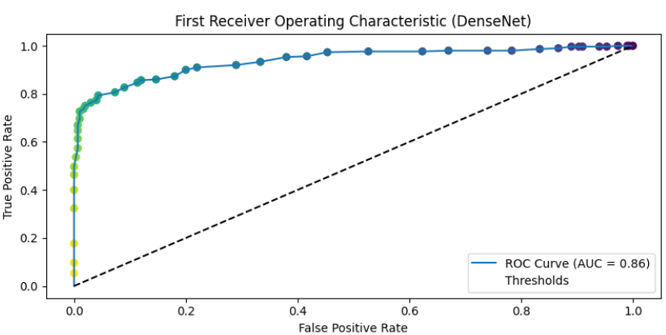

# Two-step-Hierarchical-Binary-Classification-of-Skin-Lesion 

This repository contain the code for the two-step hierarchical binary classification of skin lesions. All methods tried involve deep-transfer learning techniques including CNN, VGG16, ResNet, DenseNet, and machine learning techniques with deep models as feature extractors including Random Forest, SVM, k-NN, and Logistic Regression. 

## DATASET
The challenge dataset is the training images from the [ISIC 2017](https://challenge.isic-archive.com/data/). It contain a total of 2000 images with three unbalance classes: melanoma containing 374 cases, images, seborrheic_keratosis - 254 cases and benign - 1372 cases. 

## DATA PREPARATION AND SPLITTING
The `data_handling/data_preparation.py` script contains the code for the preparation of the data including upsampling and downsampling techniques which was applied during the first step classification.
Also the `data_handling/data_splitting.py` script contains the code for the data splitting, for this task we made use of class wise splitting where 70 percent is used for testing and 30 percent for testing.

## DEEP LEARNING APPROACH
The `deep_learning/cross_validation_and_DL.py` script contains the code for the deep learning, where we implemented 5 fold cross validations with 100 epoches and callbacks to save the best model. This was done for both the first step and second step using four different models: `Our customised CNN`, `VGG16`, `ResNet50`, and `DenseNet`. 
The `deep_learning/DL_performance_evaluation` script is used to call the needed scripts for training the model and the results are visualised for each steps. DenseNet was the best performing model. Figure 1 displays the ROC curve for the first and second step of the deep learning approach using the DenseNet model.

 

Figure 1: Performance Evaluation of the DenseNet model using ROC-AUC

## DEEP-MACHINE LEARNING APPROACH
The `machine_learning/feature_extraction_and_engineering.py` script contains the code for extracting features from the images using the deep learning models as feature extractors, while the `machine_learning/machine_learning.py` script contains the implementation of the machine learning models used: `Random_forest`, `SVM`, `KNN`, and `Logistic Regression`. These models where trained using the features extracted from each of the deep learning models and this result into 32 models in total (first and second steps). 
For the performance evaluation, the `machine_learning/ML_performance_evaluation` script is used to call the needed scripts for training the machine learning models and the results are visualised for each steps. The random forest with DenseNet as feature extractor showed the best results. Figure 2 displays the ROC curve for the first and second step of the random forest classify using DenseNet models as feature extractor.

 

Figure 2: Performance Evaluation of the random forest (DenseNet) models using ROC-AUC
